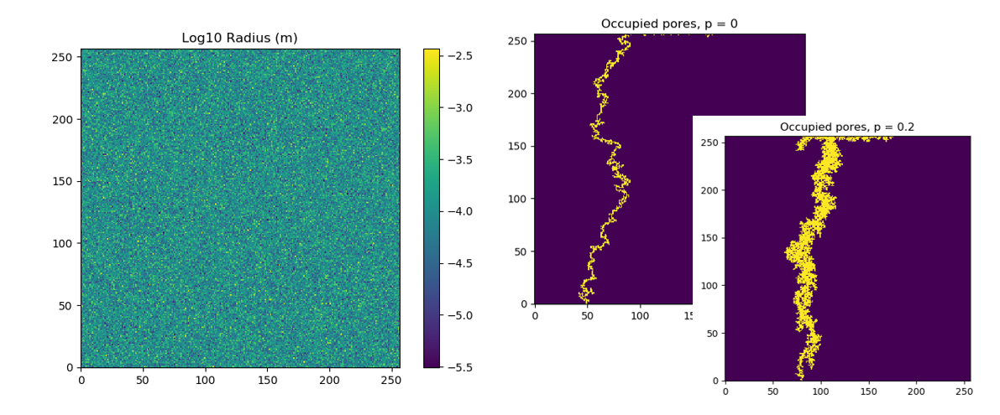
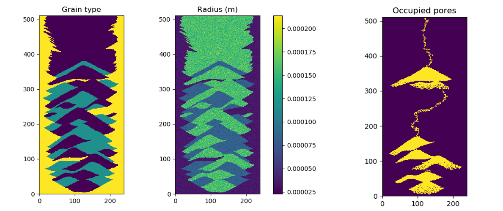
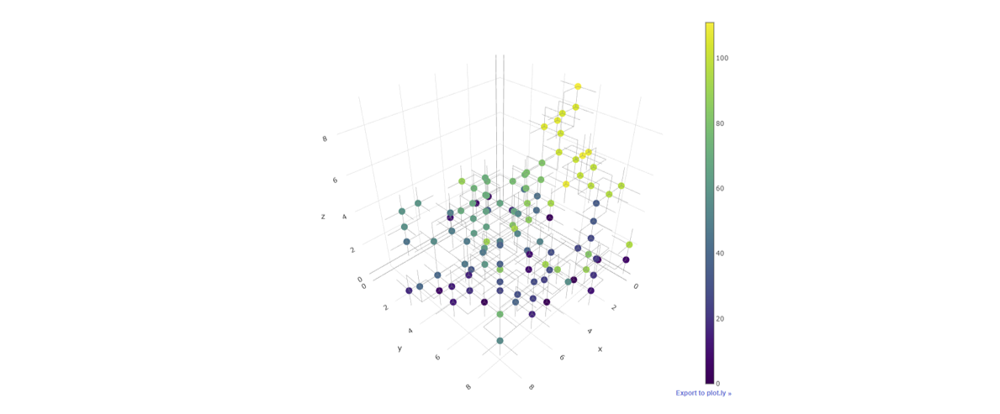
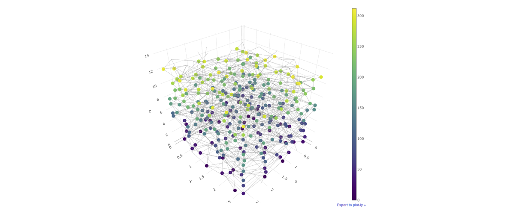

pyperc
=======================================

pyperc is a Python package for invasion percolation which models multiphase fluid migration in porous 
media.  The model accounts for capillary pressure, buoyancy, and gravity.  A tuning parameter can be 
set to adjust the stochastic nature of the process.  Model equations are from [1,2]. 

The software contains a single class, `pyperc.model.InvasionPercolation`, which is used to complete the following steps:

1. Define the regular or irregularly structured pore network including the x,y,z location of pores, connectivity 
   between pores, and pore radius. The pore network can be defined using a regularly spaced grid 
   (see [3D regular grid example](examples/grid_example.py))
   or using pore and throat files (see [3D irregular grid example](examples/network_example.py)).
2. Initialize the pore network with contact angles, invading fluid density, defending fluid density, and surface tension. 
   The user can also specify custom start and end location used to track fluid migration and the initial condition of occupied pores.
3. Run invasion percolation and specify the maximum number of iterations, stochastic selection parameter, and random seed.

Additionally, the software contains a graphics module, `pyperc.graphics` which contains a function to plot 3D pore 
network models using plotly. matplotlib can be used to create simple 2D graphics using imshow.

Examples
-----------
The software contains several examples. In the examples, the user can modify input 
parameters, including the stochastic selection process and density 
difference, to explore a range percolation processes:

* [2D random porous media example](examples/random_porous_media_example.py), based on [1]

* [2D sand pack example](examples/sand_pack_example.py), based on [2]

* [3D regular grid example](examples/grid_example.py), image shows occupied pores, colored by iteration number

* [3D irregular grid example](examples/network_example.py), image shows occupied pores, colored by iteration number

Units
---------
All units are SI:

* Length = m
* Time = s
* Mass = kg
* Pressure = Pa
* Force = N

Installation
-----------------
pyperc requires Python (3.5, 3.6, or 3.7) along with several Python package dependencies.  
Information on installing and using Python can be found at 
https://www.python.org/.  
Python distributions, such as Anaconda, are recommended to manage the Python interface.  

To install the development branch of pyperc from source using git::

	git clone https://github.com/sandialabs/pyperc
	cd pyperc
	python setup.py install

Python package dependencies include:

* numpy
* networkx
* pandas
* matplotlib
* plotly

Testing
------------
Automated testing is run using TravisCI at https://travis-ci.org/sandialabs/pyperc.
Tests can also be run locally using nosetests::
  
	nosetests -v --with-coverage --cover-package=pyperc pyperc

Copyright
------------
Copyright 2018 National Technology & Engineering Solutions of Sandia, 
LLC (NTESS). Under the terms of Contract DE-NA0003525 with NTESS, the U.S. 
Government retains certain rights in this software.

License
-------------------------
[Revised BSD](LICENSE.txt)

References
------------

[1] Ewing, R.P. and Berkowitz, B., 1998. A generalized growth model for simulating initial migration of dense non-aqueous phase liquids. Water Resources Research, 34(4), pp.611-622

[2] Glass, R.J., Nicholl, M.J., Rajaram, H. and Andre, B., 2004. Development of slender transport pathways in unsaturated fractured rock: Simulation with modified invasion percolation. Geophysical research letters, 31(6).

___
Sandia National Laboratories is a multimission laboratory managed and operated by National Technology and 
Engineering Solutions of Sandia, LLC., a wholly owned subsidiary of Honeywell International, Inc., for the 
U.S. Department of Energy's National Nuclear Security Administration under contract DE-NA-0003525.
